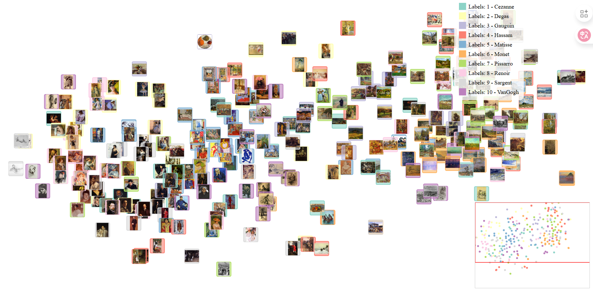
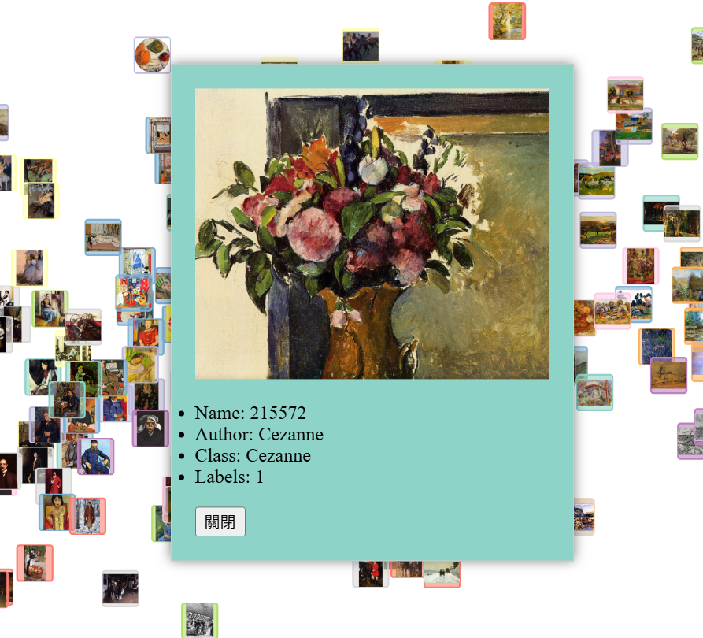

# 畫作資料集視覺化 🎨

一個使用深度學習特徵、UMAP 降維、D3.js 和 Flask 打造的互動式、資料驅動的畫作視覺化專案。

此專案現已支援處理與視覺化多位作者的畫作收藏。

## 📦 專案結構

```
project-root/
├── data/                         # 📥 用於新畫作資料集的輸入目錄 (例如: data/Monet/image.jpg)
│   ├── [Author Name 1]/          #   每個子資料夾代表一位作者
│   │   └── image_01.jpg
│   └── [Author Name 2]/
│       └── image_02.png
├── scripts/                      # 🐍 用於資料處理的 Python 腳本
│   ├── process_pipeline.py       #   用於提取特徵與降維的主腳本
├── utils/                        # 🛠️ Python 工具模組
│   ├── data_sampler.py           #   輔助資料採樣的模組
│   ├── feature_extractor.py      #   輔助深度學習特徵提取的模組
│   └── plot_umap.py              #   用於視覺化的 Flask 網頁伺服器
├── static/                       # 🌐 面向網頁的靜態資源
│   ├── main.js                   #   D3.js 視覺化邏輯
│   ├── multiAuthor_features.csv  #   ✨ 產生的包含特徵 (x, y, 作者等) 的 CSV 檔案
│   └── van-gogh-paintings/       #   原始梵谷資料集 (若不再使用可移除)
│       └── ...
├── templates/                    # 📄 用於網頁介面的 HTML 模板
│   └── index.html                #   主視覺化頁面
├── requirements.txt              # 📋 Python 依賴套件列表
└── README.md                     # 📄 專案文件
```

## ✨ 功能特色

*   **深度學習特徵提取**：使用 EfficientNet-B5 從圖片中提取豐富的特徵。
*   **維度降低**：應用 t-SNE 將高維度特徵投影到一個互動式的 2D 空間中。
*   **互動式網頁視覺化**：在 Flask 應用程式中使用 D3.js 驅動的散點圖。
*   **支援多作者資料集**：可輕鬆處理並視覺化來自多位藝術家的作品集。
*   **互動式作者篩選器**：透過複選框顯示或隱藏特定作者的作品。
*   **搜尋與突顯**：可依作者或檔名進行搜尋，並在圖表中突顯符合條件的資料點。
*   **顯示群組中心點**：計算並在地圖上標示出每個作者作品群組的中心位置。
*   **顯示作者資訊**：點擊圖片會彈出視窗，顯示作者與作品等詳細資訊。

## 🚀 安裝說明


### 1. 建立並啟用您的 Python 虛擬環境 (建議)
```bash
python -m venv venv                 # 建立虛擬環境 (僅限首次)
.\venv\Scripts\activate             # 在 Windows 上啟用
source venv/bin/activate            # 在 Linux/macOS 上啟用
```

### 2. 安裝必要的 Python 套件
```bash
pip install --upgrade -r requirements.txt
```
**GPU 使用者請注意：** 如果您希望使用 NVIDIA GPU 來進行特徵提取 (為提升效能，強烈建議)，請確保您安裝了**支援 CUDA 的 PyTorch 版本**。請參考 [PyTorch 官方網站](https://pytorch.org/get-started/locally/) 以取得符合您 CUDA 版本和系統的特定安裝指令。

### 3. 下載資料集
此專案使用 Kaggle API 來下載所需的圖片資料集。

**A. 設定 Kaggle API 金鑰**
在執行下載腳本之前，您需要先設定您的 Kaggle API 金鑰。請依照 [Kaggle API 官方文件](https://www.kaggle.com/docs/api) 的說明進行認證。通常這涉及到：
1.  登入 Kaggle 網站。
2.  前往您的帳號頁面，點擊 "Create New Token"。
3.  下載 `kaggle.json` 檔案，並將其放置在指定的位置 (例如 `C:\Users\<Your-Username>\.kaggle\kaggle.json`)。

**B. 執行下載腳本**
設定好 API 金鑰後，執行以下指令來下載並自動解壓縮資料集至 `data/` 目錄：
```bash
python scripts/download_dataset.py
```

## ▶️ 使用方式

### 1. 產生特徵資料
首先，執行資料處理流程以提取特徵並計算您圖片的 2D 座標。此步驟將會建立 `static/multiAuthor_features.csv` 檔案。
```bash
python scripts/process_pipeline.py
```

### 2. 啟動網頁視覺化伺服器
接著，啟動提供互動式視覺化介面的 Flask 應用程式。
```bash
python utils/plot_umap.py
```
應用程式將會運行在：
📍 `http://127.0.0.1:5001`

### 3. 查看視覺化結果
打開您的網頁瀏覽器並前往上述網址，即可與畫作視覺化介面互動。將滑鼠懸停在資料點上，即可查看圖片縮圖和作者詳細資訊。

## 🖼️ 介面截圖 


### 整體介面


### 選取／懸停於圖片上

